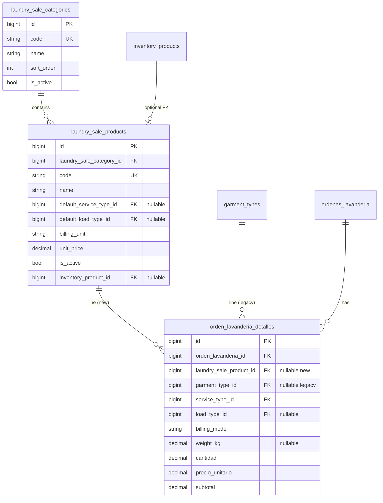

# ADR-001: Catálogo POS por producto y categoría (sustituye matriz servicio × prenda)

| Campo | Valor |
|--------|--------|
| Estado | Aceptado (fase 0 — arquitectura) |
| Fecha | 2026-04-23 |
| Contexto | `docs/PROMPTS_EQUIPO_MIGRACION_PRODUCTOS_POS.md`, `docs/ANALISIS_LOGICA_NEGOCIO.md` |

---

## 1. Contexto

Hoy el POS de lavandería arma líneas con **`service_type_id`**, **`garment_type_id`**, **`load_type_id`**, **`billing_mode`** y precios desde **`laundry_piece_prices`** (matriz C2) y defaults en **`garment_types`**. El catálogo expone `GET /api/laundry/pos-catalog` (y alias `/api/lavanderia/pos/catalog`) vía `LavanderiaPosCatalogController`.

El negocio requiere **dejar de modelar por “tipo de prenda”** y vender por **producto de catálogo** con **categorías**, precios coherentes y **snapshot en la línea** al cobrar.

El módulo **`inventory_*`** es dominio de **almacén**; el análisis actual desaconseja mezclarlo con el ticket de lavandería salvo decisión explícita.

---

## 2. Decisión

### 2.1 Catálogo: Opción A (catálogo POS propio)

Se adopta **catálogo de venta lavandería propio** (tablas nuevas bajo un prefijo acordado en implementación, p. ej. `laundry_sale_categories` y `laundry_sale_products`), **no** extender `inventory_products` como fuente única del POS.

**Motivos:**

- Respeta la separación documentada entre ticket de lavandería e inventario de almacén (`ANALISIS_LOGICA_NEGOCIO.md` §7).
- Permite precios y unidades de cobro del negocio lavandería sin arrastrar tipo/marca/proveedor del almacén.
- **Opcional en fases posteriores:** columna nullable `inventory_product_id` en el producto POS si en el futuro una fila vendible debe descontar stock de almacén; movimientos solo vía flujo de inventario ya existente, no inventado en este ADR.

**Opción B rechazada en esta decisión:** flags en `inventory_products` como único catálogo POS (alto acoplamiento operativo y de permisos).

### 2.2 Cabecera vs línea (atributos TIBU que permanecen)

| Concepto | Ubicación propuesta | Notas |
|----------|---------------------|--------|
| `priority_level_id` | **Cabecera** `ordenes_lavanderia` | Ya existe; sin cambio de lugar. |
| Envío / domicilio | **Cabecera** (`ShippingOrder` u equivalente) | Sin cambio conceptual. |
| `service_type_id` | **Línea** (recomendado) o derivado del producto | Muchos productos pueden implicar un servicio (lavado / planchado / completo). Se puede modelar **por defecto en el producto** (`default_service_type_id`) y permitir override en línea solo si el negocio lo exige. **Decisión v1:** guardar `service_type_id` en **línea** para compatibilidad con operación y reportes; el producto POS puede tener default que pre-rellena el POS. |
| `load_type_id` | **Línea** opcional | Sigue afectando rutas por área / patio; si el producto tiene default, el POS lo propone. |
| `billing_mode` (`by_weight` / equivalente pieza) | **Línea** | Snapshot + cantidad / `weight_kg` según modo; el producto define **unidad de cobro por defecto** (`billing_unit`: `piece` \| `kg`). |
| Precio unitario / subtotal | **Línea** | Snapshot al vender; no recalcular desde catálogo al editar catálogo a futuro. |

### 2.3 Línea de orden (`orden_lavanderia_detalles`)

- Añadir **`laundry_sale_product_id`** (nullable, FK al catálogo POS).
- **Líneas nuevas:** `laundry_sale_product_id` obligatorio cuando el flujo POS nuevo esté activo; `garment_type_id` **nullable** y no usado en UI nueva.
- **Líneas históricas:** conservar `garment_type_id` / `service_type_id` / datos actuales; lectura y reportes pueden etiquetar “legacy (prenda)”.

### 2.4 Precio en flujo nuevo

- Precio vigente sale del **producto POS** (p. ej. `unit_price` o campos por tipo de servicio si el negocio lo requiere) con reglas en **servicio** documentadas en implementación.
- **Cobro por kg:** regla global o por producto según `config/lavanderia.php` y ADR de implementación; **`PricingRule`** / kg puede convivir temporalmente hasta migrar a precio explícito en producto o tabla de reglas unificada.
- **`laundry_piece_prices`:** dejar de ser fuente para **líneas nuevas**; deprecación progresiva tras paridad de tests.

---

## 3. Modelo de datos (objetivo)

### 3.1 Entidades nuevas (nombres lógicos)

1. **`LaundrySaleCategory`** — agrupa productos POS; `code`, `name`, `sort_order`, `is_active`.
2. **`LaundrySaleProduct`** — ítem vendible en recepción: FK categoría, `code`/`sku` opcional, `name`, `description` nullable, `default_service_type_id` nullable, `default_load_type_id` nullable, `billing_unit` (`piece`|`kg`), `unit_price` (decimal; o precios por servicio si se modelan columnas adicionales en v1), `is_active`, `sort_order`, **`inventory_product_id`** nullable (fase opcional).

### 3.2 Diagrama (Mermaid)

---

## 4. Estrategia de migración de datos históricos

1. **Sin backfill obligatorio en v1:** órdenes existentes siguen con `garment_type_id`; reportes y PDF muestran lo guardado en snapshot.
2. **Opcional:** job o migración de datos que cree productos POS “sombra” por cada `garment_type` + `service_type` usado en histórico, solo para unificar etiquetas en UI de consulta (fuera del alcance mínimo de la primera implementación).
3. Seeders nuevos para categorías/productos de ejemplo alineados al negocio local.

---

## 5. API y rutas

### 5.1 A sustituir o versionar (contrato POS)

| Método | Ruta actual | Acción propuesta |
|--------|-------------|------------------|
| GET | `/api/laundry/pos-catalog` | Respuesta nueva: `categories`, `products` (y metadatos mínimos: `service_types`, `load_types`, `priority_levels`, `price_per_kg` si aplica). Payload `garment_types` + `laundry_piece_prices` **deprecated** tras flag o versión. |
| GET | `/api/lavanderia/pos/catalog` | Mismo cuerpo que el canónico o redirect documentado. |
| POST | `/api/laundry/pos/preview-totals` | Items con `laundry_sale_product_id` (+ cantidad, billing, peso). |
| POST | `/api/lavanderia/ordenes` | Ítems del carrito alineados al validador nuevo. |

### 5.2 Admin — deprecación progresiva

| Método | Ruta | Acción |
|--------|------|--------|
| CRUD | `/api/admin/garment-types` | Sustituir por **admin catálogo POS** (categorías / productos) bajo el mismo permiso `administracion.areas` o permiso nuevo acordado (`administracion.pos_catalog` si se desea granularidad). |

### 5.3 Sin cambio de contrato en esta ADR

- Escaneo por áreas, QR, caja, tracking público, inventario `/api/inventory/*`.

---

## 6. Tablas y código a tocar (inventario para fases 1–7)

**Base de datos:** nuevas `laundry_sale_*`; alter `orden_lavanderia_detalles` (+ índices FK).

**Backend (no exhaustivo):** `OrdenLavanderiaDetalle`, `OrdenLavanderiaService`, `OrdenLavanderiaDetalleLineValidator`, `LaundryPricingService`, `LaundryPosPreviewTotalsService`, `LavanderiaPosCatalogController`, `OrdenLavanderiaController` (store/show), `LaundryPosPreviewTotalsRequest`, requests de orden; políticas/seeders de `GarmentType` en retirada.

**Frontend:** `resources/js/src/views/ventas/pos.vue`, repos POS, `ticketPosPdf.js`, `garment-types.vue` / `GarmentTypesAdminRepository.js` → equivalente catálogo POS, `router`, `sidebar`, locales.

**Tests:** `LaundryPricingC2Test`, `OrdenLavanderiaC1LaundryLineTest`, `GarmentTypeAdminTest`, etc. — actualizar o reemplazar según contrato nuevo.

**Documentación:** `docs/ANALISIS_LOGICA_NEGOCIO.md`, `.cursorrules`, `docs/PROMPTS_EQUIPO_MIGRACION_PRODUCTOS_POS.md` (referencia a este ADR como `ADR-001`).

---

## 7. Riesgos y mitigación

| Riesgo | Mitigación |
|--------|------------|
| Romper POS en producción | Convivencia temporal en API o feature flag; tests de regresión antes de quitar `garment_types` del JSON. |
| Confusión con `productos` legacy | Nombres `laundry_sale_*` y documentación explícita en UI (“Catálogo POS”). |
| Stock almacén | Solo FK opcional y flujo de movimientos ya existente; no mezclar tablas sin ADR de operación. |

---

## 8. Siguiente fase (recordatorio)

**Fase 1 — Backend datos (hecho):** migraciones `2026_04_23_140000_create_laundry_sale_catalog_tables`, `2026_04_23_140001_add_laundry_sale_product_id_to_orden_lavanderia_detalles_table`; modelos `LaundrySaleCategory`, `LaundrySaleProduct`; factories; `LaundrySaleCatalogSeeder`; relación en `OrdenLavanderiaDetalle`.

**Fase 2 — Backend dominio (hecho):** `OrdenLavanderiaDetalleLineValidator` (líneas `laundry_sale_product_id`), `LaundryPricingService::previewSaleCatalogLineMoney`, `LaundryPosPreviewTotalsService`, `OrdenLavanderiaService` (creación de detalle con FK), `LaundryPosPreviewTotalsRequest` y `OrdenLavanderiaController` (validación + eager load), `LavanderiaPosCatalogController` (`laundry_sale_categories`, `laundry_sale_products` en JSON).

**Fase 3 — API / front (hecho):** CRUD admin `laundry_sale_*` (API + `laundry-pos-catalog.vue`, router, menú), POS (`pos.vue`) con líneas `laundry_sale_product_id`, `buildItemsPayload` / preview / validación, ticket cliente jsPDF + ticket térmico servidor (`TicketThermalSections`, `TicketObservationLines`), tests `LaundrySaleCatalogAdminTest`, locales `admin.laundry_pos_catalog` y `ventas.pos.*` asociados.

**Fase 4 — QA y reportes (hecho):** tests `LaundryPosSaleCatalogQaTest` (estructura catálogo POS, preview/orden mixta TIBU+catálogo, rechazo `garment_type_id`+`laundry_sale_product_id`, `show` con `laundry_sale_product`); CSV historial `export-csv` con columna `laundry_sale_lines_count`; PHPDoc de ejemplo en `LavanderiaPosCatalogController`.

**Fase 5 — Documentación (hecho):** alineación de `docs/ANALISIS_LOGICA_NEGOCIO.md` (resumen, rutas §2.1, modelos §2.4, servicios §2.5, frontend §3, flujos §4, tablas §6, notas §7, §8), `docs/ESTRUCTURA_DATOS_CRITICA.md` (catálogo POS en líneas), `.cursorrules` (dominio POS: tres tipos de línea y tablas canónicas vs legacy).

**Fase 6 — QA operativo checklist (hecho):** `docs/CHECKLIST_QA_VENTA_CAJA_TICKET_TIBU.md` ampliado (catálogo POS, carrito mixto, ticket/CSV, **C8.5**); comandos de regresión documentados (`LaundryPosSaleCatalogQaTest`, `LaundrySaleCatalogAdminTest` junto a `composer run test:tibu-c8`).

**Fase 7 — Documentación §5.8 (hecho):** `docs/ANALISIS_LOGICA_NEGOCIO.md` §1 y **§6.1** (tablas canónicas vs legacy / histórico); `.cursorrules` bloque explícito «Tablas: canónico vs legacy» bajo POS; referencia cruzada en §8 verificación.

**Fase 8 — Cierre integración / reportes (hecho):** `VentasController::mensual` expone **`lineas_catalogo_pos`** (agregado por mes, portable MySQL/SQLite); vista `mensuales.vue`; test `VentasMensualCatalogoPosTest` en suite `TibuC8Regression`; CSV historial sin cambio (`laundry_sale_lines_count` por orden).

---

## 9. Estado de revisión

Este ADR cierra la **fase 0 (Arquitecto)**. Las decisiones de implementación fina (nombres exactos de columnas, si `service_type_id` se duplica desde el producto al insertar línea, etc.) pueden afinarse en PRs siempre que no contradigan las decisiones §2 sin nueva revisión.
