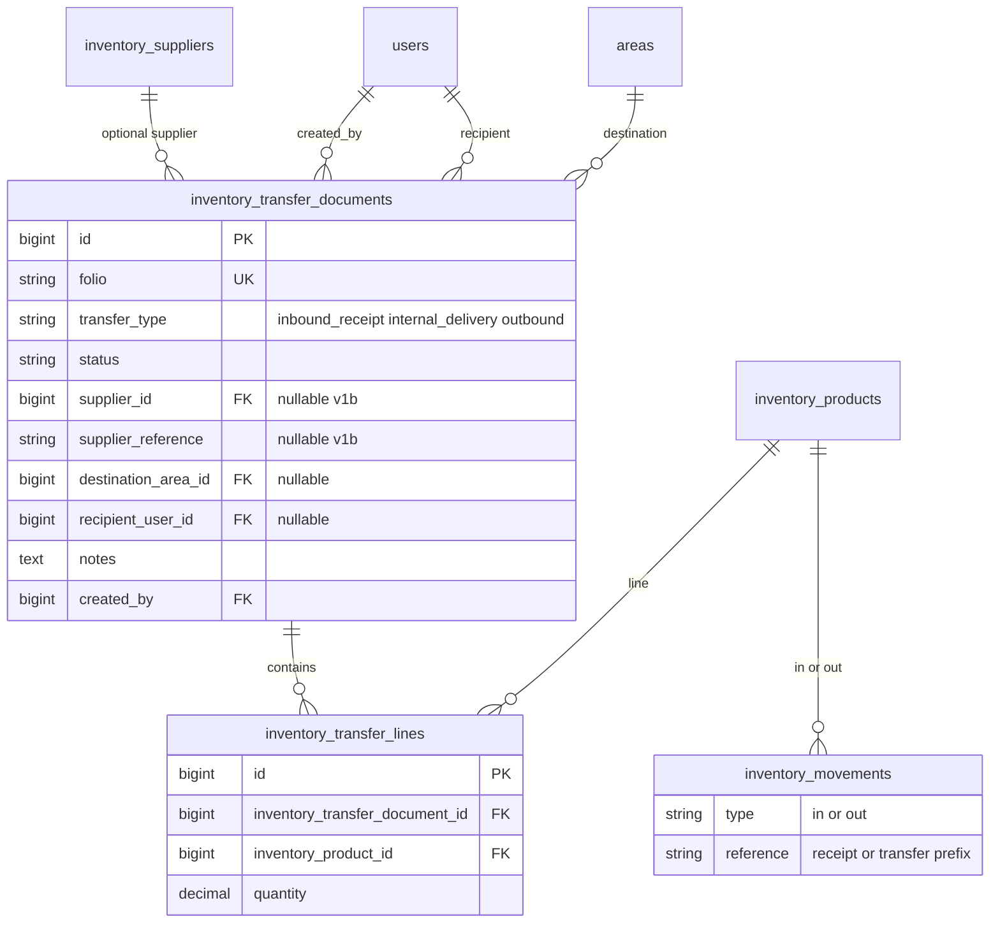

# ADR-002: Documentos de inventario — **entradas**, **salidas** y **entregas internas** (`inventory_*`)

| Campo | Valor |
|--------|--------|
| Estado | **Aceptado (fase 0 — arquitectura v2, abril 2026)** |
| Fecha | 2026-04-24 |
| Contexto | `docs/PROMPTS_MODULOS_ENTREGA_SALIDA_INVENTARIO.md`, `docs/ADR-001-pos-catalogo-productos.md` §2.1, `docs/ANALISIS_LOGICA_NEGOCIO.md` |

---

## 1. Contexto

Hoy el almacén registra movimientos **atómicos** por producto:

- `GET|POST /api/inventory/products/{inventory_product}/movements`
- `InventoryMovementService::record` / `recordMovementWithoutTransaction` con `type` ∈ `in` | `out` | `adjustment`, y `stock_quantity` en transacción con `lockForUpdate`.

Eso cubre entrada/salida **puntual**, pero **no** cubre bien:

1. **Recepción a almacén (entrada documentada):** varias líneas en un acto (compra, donación, devolución a central), folio, borrador y confirmación masiva.
2. **Entrega de insumos** almacén → **área** y/o **usuario** en planta (`internal_delivery`), trazabilidad sin ticket de lavandería.
3. **Salida documentada** agregada (`outbound`): merma, consumo administrativo, despacho a tercero sin módulo fiscal en v1.

La **entrega de orden de lavandería al cliente** (`ordenes_lavanderia`) es **otro dominio** (§5).

---

## 2. Decisiones

### 2.1 Un modelo de documento, tres `transfer_type`

Una cabecera **`inventory_transfer_documents`** y líneas **`inventory_transfer_lines`** con discriminador:

| `transfer_type` | Movimiento al confirmar | Uso |
|-----------------|-------------------------|-----|
| `inbound_receipt` | Una fila `inventory_movements` por línea con **`type = in`** | Recepción de mercancía al almacén. |
| `internal_delivery` | **`type = out`** por línea | Entrega interna a planta / receptor. |
| `outbound` | **`type = out`** por línea | Salida administrativa / despacho no fiscal v1. |

**Estados** (iguales para los tres tipos):

| Estado | Significado |
|--------|-------------|
| `draft` | Editable; sin efecto en stock. |
| `confirmed` | Inmutable en líneas; movimientos `in` o `out` **ya creados** en la confirmación (según tipo). |
| `cancelled` | Abortado en borrador; **sin** movimientos generados. |

Transiciones: `draft → confirmed`, `draft → cancelled`. No `confirmed → draft`.

### 2.2 Cabecera: campos comunes y recepción (entrada)

**Ya persistidos (migración fase 1):** `folio`, `transfer_type`, `status`, `destination_area_id`, `recipient_user_id`, `notes`, `created_by`, `confirmed_by` / `confirmed_at`, `cancelled_by` / `cancelled_at`, timestamps.

**Migración 1b (hecha):** columnas opcionales en cabecera:

| Columna | Tipo | Notas |
|---------|------|--------|
| `supplier_id` | FK nullable → `inventory_suppliers` | Proveedor (opcional). |
| `supplier_reference` | `string(128)` nullable | Factura, remisión, OC, etc. |

Los borradores `inbound_receipt` pueden omitir proveedor y referencia; validación estricta opcional vía `FormRequest` según política del negocio.

### 2.3 Reglas de validación al **confirmar**

| `transfer_type` | Reglas |
|-----------------|--------|
| `inbound_receipt` | Líneas no vacías; cantidades &gt; 0; producto activo; **no** exige área ni receptor (el stock **entra** al almacén central). Opcional (post 1b): `supplier_id` o `supplier_reference` si el negocio lo exige — documentar en FormRequest al activarse. |
| `internal_delivery` | Igual que hoy: **al menos uno** de `destination_area_id` o `recipient_user_id` obligatorio al confirmar. |
| `outbound` | Líneas válidas; área y receptor **opcionales** (salida puramente administrativa). |

### 2.4 Referencias en `inventory_movements` (v1)

Prefijos estables en `reference` (sin migrar columnas nuevas en `inventory_movements`):

| Tipo documento | Formato `reference` por línea |
|----------------|--------------------------------|
| `inbound_receipt` | `receipt:{folio}:line:{line_id}` |
| `internal_delivery`, `outbound` | `transfer:{folio}:line:{line_id}` |

### 2.5 Alcance de “salida” atómica existente

El `POST .../movements` con `out` / `in` **se conserva**; el documento es flujo **opcional** y agregado.

### 2.6 Servicio de dominio

- **`InventoryTransferDocumentService`** (existente para OUT): debe **extenderse** para que `confirm()`:
  - Si `transfer_type` es `inbound_receipt`: por línea llamar `recordMovementWithoutTransaction` con **`TYPE_IN`** y cantidad positiva de entrada, `reference` con prefijo `receipt:`.
  - Si es `internal_delivery` u `outbound`: mantener **`TYPE_OUT`** y prefijo `transfer:`.
- Misma transacción global, mismo orden de bloqueo por `inventory_product_id` e `id` de línea.
- **`cancelDraft`:** sin cambio (solo cabecera en `draft`).

### 2.7 Permisos

Reutilizar **`inventory.manage`** / **`inventory.view`** como en la versión anterior del ADR.

---

## 3. Diagrama (Mermaid)

---

## 4. API objetivo (fases posteriores)

| Método | Ruta propuesta | Uso |
|--------|----------------|-----|
| GET | `/transfer-documents` | Listado; filtros `transfer_type`, `status`, fechas. |
| POST | `/transfer-documents` | Crear borrador (`draft`) con `transfer_type` elegido. |
| GET | `/transfer-documents/{id}` | Detalle + líneas. |
| PATCH | `/transfer-documents/{id}` | Cabecera solo en `draft` (incl. supplier fields cuando existan). |
| POST | `/transfer-documents/{id}/lines` | Añadir línea en `draft`. |
| DELETE | `/transfer-documents/{id}/lines/{line}` | Quitar línea en `draft`. |
| POST | `/transfer-documents/{id}/confirm` | Confirma: genera movimientos **`in`** o **`out`** según `transfer_type`. |
| POST | `/transfer-documents/{id}/cancel` | Cancela borrador. |

`GET|POST /api/inventory/products/{id}/movements` permanece.

---

## 5. Fuera de alcance

- Descuento automático por orden/etapa de lavado sin ADR aparte.
- Acoplamiento ticket lavandería ↔ inventario sin ADR.
- CFDI / facturación electrónica v1.

---

## 6. Criterios de aceptación

- Confirmar `inbound_receipt` **aumenta** stock y crea movimientos `in` con `reference` `receipt:…`.
- Confirmar `internal_delivery` / `outbound` **reduce** stock y crea `out` con `transfer:…`.
- Dos líneas mismo producto (mismo tipo de movimiento) en una confirmación: orden de bloqueo determinista, sin stock negativo en entradas (N/A) ni en salidas sin saldo.
- Cancelar `draft` no altera stock.
- Permisos: mutación solo `inventory.manage`.

---

## 7. Fases de implementación (recordatorio)

| Fase | Contenido |
|------|-----------|
| 1 | **Hecho:** tablas base `inventory_transfer_documents` / `inventory_transfer_lines`. |
| **1b** | **Hecho:** migración `2026_04_24_130000_add_supplier_fields_to_inventory_transfer_documents_table`; modelo actualizado (`supplier_id`, `supplier_reference`, relación `supplier()`). |
| 2 | **Hecho:** `InventoryTransferDocumentService::confirm()` registra **OUT** (`internal_delivery`, `outbound`) y **IN** (`inbound_receipt`) con referencias `transfer:` / `receipt:` según §2.6. |
| 3 | **Hecho:** REST bajo `/api/inventory/transfer-documents` (+ `confirm`, `cancel-draft`); FormRequest por acción; tests Feature (IN, OUT, 403 sin `inventory.manage`). |
| 4 | **Hecho:** Vue — listado `/inventario/documentos`, alta `/inventario/documentos/crear`, detalle `/:id` (borrador editable, confirmar/cancelar con modales); i18n y repositorio JS. |
| 5 | **Hecho:** QA — tests Feature (`InventoryTransferDocument*`, idempotencia confirm vía API, 403 mutaciones sin `manage`); checklist manual `docs/CHECKLIST_QA_INVENTARIO_DOCUMENTOS_ENTREGA_SALIDA.md`. |
| 6 | **Hecho:** `ANALISIS_LOGICA_NEGOCIO.md`, `.cursorrules`, `GAP_ANALYSIS_LAVANDERIA.md` §2 y referencias a checklist QA. |
| 7 | **Hecho:** `ESTRUCTURA_DATOS_CRITICA.md` (inventario documentos), `CHANGELOG_INTERNO_TIBU.md`, cierre de trazabilidad en docs transversales. |

---

## 8. Estado de revisión

**Fase 0 (arquitecto):** este ADR define los tres `transfer_type`, estados, referencias `receipt:` / `transfer:`, cabecera extendida planificada (1b) y comportamiento del servicio al confirmar. La implementación debe alinearse; si el código diverge, actualizar este archivo en el mismo PR.

**Documentación de producto (fase 6):** resumen operativo en `docs/ANALISIS_LOGICA_NEGOCIO.md`, reglas persistentes para agentes en `.cursorrules`, matriz de brechas §2 en `docs/GAP_ANALYSIS_LAVANDERIA.md`, y QA manual en `docs/CHECKLIST_QA_INVENTARIO_DOCUMENTOS_ENTREGA_SALIDA.md`.

**Fase 7 (cierre):** tablas y referencias en `docs/ESTRUCTURA_DATOS_CRITICA.md` §5; entrada en `docs/CHANGELOG_INTERNO_TIBU.md`.
